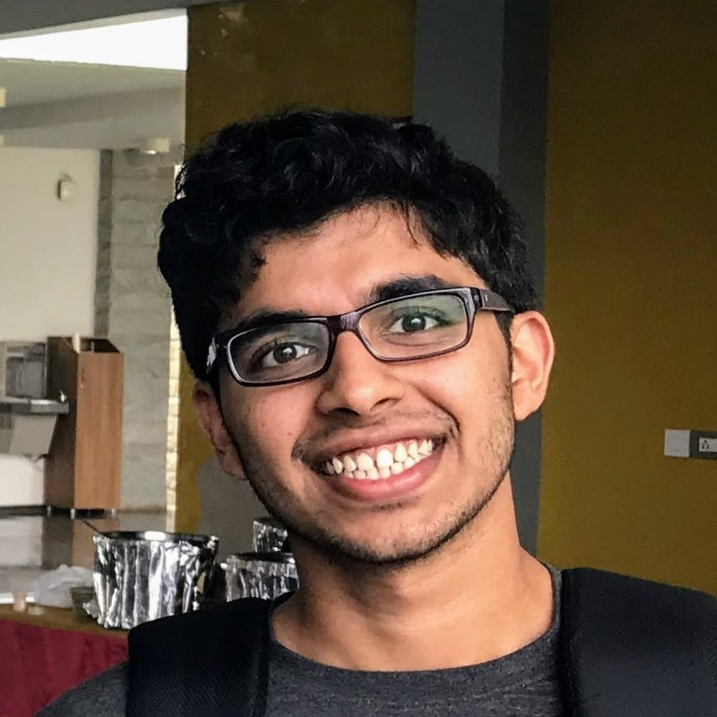

Title: About me
Date: 14/12/2017
Priority: 0
save_as: index.html

<table class="image">
<tr><td></td></tr>
</table>

I was a graduate student in pure mathematics at the University of Michigan, advised by Alex Wright.
My thesis focused on hyperbolic geometry, Teichmüller dynamics, and Patterson-Sullivan theory.
I am currently learning how to use the [Lean theorem prover](https://lean-lang.org/), formalizing results about $\mathrm{Out}(F_n)$ in Lean, and documenting my learning [here](tag/lean.html).

Outside of math, I enjoy rock climbing and [cycling](pages/cycling.html), proselytizing [Emacs](https://www.gnu.org/software/emacs/), and programming in [Rust](https://www.rust-lang.org/) and [Haskell](https://www.haskell.org/).

### Recent timeline
Here's a list of conferences/workshops/seminars I have been in recently.

- **February 2024**: Group Actions and Dynamics Seminar, University of Wisconsin, Madison
- **January 2023**: Salt Flat MRC, University of Utah, Salt Lake City
- **December 2022**: Dynamics Seminar, University of Washington, Seattle
- **July 2022**: Topology Students Workshop, Georgia Tech, Atlanta
- **November 2021**: Midwest Dynamical Systems, Northwestern University, Evanston
- **July 2021**: Park City Math Institute Summer Graduate School, Virtual
- **June 2021**: CMI-HIMR Dynamics and Geometry Online Summer School, Clay Mathematics Institute, Heilbronn Institute for Mathematical Research

For a more complete list, see the Conferences section in my [CV](pages/cv.html).
<!-- ### Quick links -->

<!-- These are some articles and notes I have written in the past which I'm too lazy to rewrite on my -->
<!-- blog. My [university homepage](http://www-personal.umich.edu/~saykhan/notes.html) has a more up to date -->
<!-- list of articles. -->

<!-- - [Summary](pdfs/thesis_summary/thesis-summary.pdf) of my undergraduate final year project -->
<!-- which dealt with the Laplacian on Riemannian manifolds. -->
<!-- - [Notes](pdfs/ggd_notes/spherical_geometry.pdf) on spherical geometry I took -->
<!-- at GGD 2017. -->
<!-- - [Article](pdfs/articles/technical_results.pdf) containing some -->
<!--   technical results in homotopy theory. -->
<!-- - [Article](pdfs/articles/weyls.pdf) on Weyl's equidistribution theorem. -->
<!-- - [Article](pdfs/articles/roths.pdf) on Roth's theorem on existence of -->
<!--   three-term arithmetic progressions in positive density subsets of natural -->
<!--   numbers. -->
