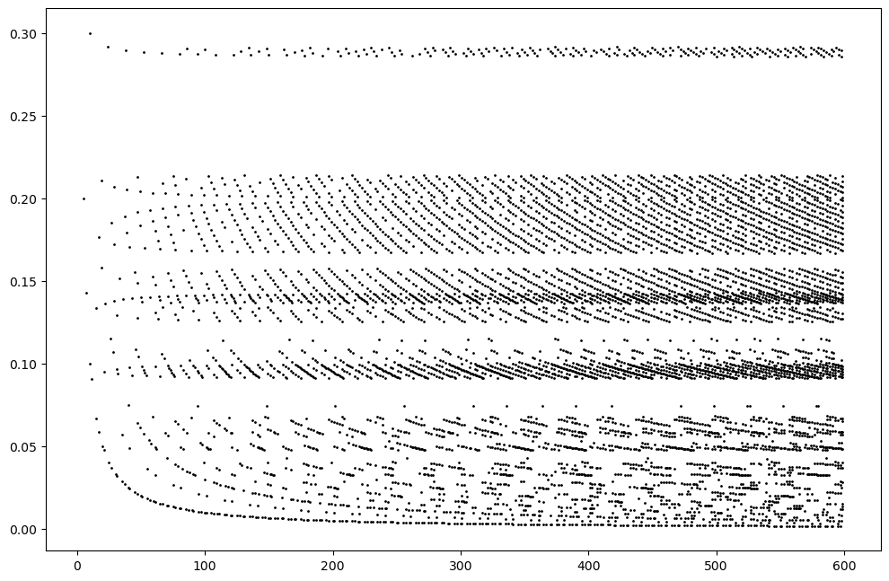

Title: Research
Date: 10/08/2022
Priority: 1
JavaScripts: toggle_vis.js

### Research interests
  I am broadly interested in the Teichmüller space, and its isometrically embedded submanifolds, as well as
	subgroups of the mapping class group and their action on these spaces. A particular example of such a
	isometrically embedded submanifold is the Teichmüller space of non-orientable surfaces, which embeds as a
	totally real submanifold, and whose stabilizer is the mapping class group of non-orientable surfaces. The
	action of the stabilizer has surprising dynamical properties, and I'm interested in understanding how the
	dynamics differ from the orientable version.

I have also of late been thinking about *hierarchically hyperbolic spaces*, and about the dynamics of *hierarchicically hyperbolic groups* acting on them.

### Papers

<ol reversed>
	<li>
	<i>Towards Patterson-Sullivan theory for Teichmüller spaces of non-orientable surfaces.</i> (<a href="https://sayantangkhan.github.io/geodesics-in-thin-part/statistical-convex-cocompactness.pdf">Link</a> to pre-arXiv draft)
(<a href="research.html#" onclick="toggle_visibility('statconvex'); return false;">abstract</a>)

  We show that a finite volume deformation retract
  𝒯<em>ε</em><em>t</em>−(𝒩<em>g</em>)/MCG(𝒩<em>g</em>)
of the moduli space of non-orientable surface
ℳ(𝒩<em>g</em>)
behaves like the convex core of
ℳ(𝒩<em>g</em>),
despite not even being quasi-convex.
  Moreover, we show that geodesics in the convex core leave compact regions with exponentially low probabilities, showing that the action of
  MCG(𝒩<em>g</em>)
  on
  𝒯<em>ε</em><em>t</em>−(𝒩<em>g</em>)/MCG(𝒩<em>g</em>)
  is statistically convex-cocompact.
  In combination with recent results of Coulon, Gekhtman, Ma, Tapie, and Yang, this leads to the construction of a finite geodesic flow invariant measure for Teichmüller spaces of non-orientable surfaces, with respect to which the geodesic flow is mixing.
 

	</li>

	<li><i>The limit set of non-orientable mapping class groups</i>.
	  (In <i><a href="https://www.aimsciences.org/article/doi/10.3934/jmd.2023007">Journal of Modern Dynamics</a></i>; <a href="https://arxiv.org/abs/2110.00037">arXiv:2110.00037</a>)
	  (<a href="research.html#" onclick="toggle_visibility('limitset'); return false;">abstract</a>)

	We provide evidence both for and against a conjectural analogy between geometrically finite infinite
	covolume Fuchsian groups and the mapping class group of compact non-orientable surfaces. In the positive
	direction, we show the complement of the limit set is open and dense. Moreover, we show that the limit set
	of the mapping class group contains the set of uniquely ergodic foliations and is contained in the set of
	all projective measured foliations not containing any one-sided leaves, establishing large parts of a
	conjecture of Gendulphe. In the negative direction, we show that a conjectured convex core is not even
	quasi-convex, in contrast with the geometrically finite setting.
 

	</li>
	<li><i>Pseudo-Anosov homeomorphisms of punctured non-orientable surfaces with small stretch factor</i>. With Caleb Partin and <a href="https://sites.google.com/site/rebeccawinarski/">Becca
	Winarski</a>.
	  (In <i><a href="https://msp.org/agt/2023/23-6/p12.xhtml">Algebraic & Geometric Topology</a></i>; <a href="https://arxiv.org/abs/2107.04068">arXiv:2107.04068</a>)
(<a href="research.html#" onclick="toggle_visibility('fiberedfaces'); return false;">abstract</a>)

  We prove that in the non-orientable setting, the minimal stretch factor of a pseudo-Anosov homeomorphism of
  a surface of genus g with a fixed number of punctures is asymptotically on the order of 1/g.
  Our result adapts the work of Yazdi to non-orientable surfaces.  We include the details of Thurston's theory
  of fibered faces for non-orientable 3-manifolds.
 

	</li>
  </ol>

### Computer experiments

I also write computer programs to assist in visualization of exotic geometric
objects, as well as testing small conjectures.  I usually upload my cleaned up code
on [Github](https://github.com/sayantangkhan), but if it's a small one-off program, I might not
make it public. In case you would like access to the code anyways, let me know, and I will be happy to share it.

#### Limit set of a non-orientable mapping class group

  

	  
	

 A part of the limit set of the mapping class group of a non-orientable surface of genus 6
  when restricted to a 3-dimensional stratum of projective measured foliations.  Unlike in
  the orientable case, the limit set is not the entire stratum, but rather a nowhere dense
  measure 0 subset.  The Hausdorff dimension of the limit set restricted to a dimension
  n-stratum is bounded between n-1 and n-2, where the upper bound is sharp.  Locally,
  the limit set is contained in a hyperplane, and the image is a rendering of the limit set
  when restricted to one such hyperplane.

#### Resolving intersections of parallel copies of intersecting curves

Given two two-sided curves on a
non-orientable surface with positive intersection, we can take m and n parallel copies of the curves
and resolve all the intersections in a consistent manner to get a multicurve.
[This code](https://github.com/sayantangkhan/counting-components) resolves all the intersection, and counts the number of one-sided
and two-sided components of the resulting multicurve.
If there are no one-sided components, the program plots the point $(m+m, \frac{m}{m+n})$ on a scatter plot.
The fact that the projection to the y-axis is not dense in $[0,1]$ seems to suggest that a convex combination of two minimal foliations that are
approximable by two-sided multicurves may not itself be approximable by two-sided multicurves.

	

